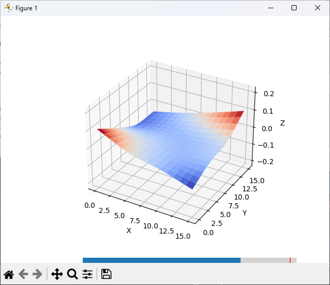

Printer must have a touch probe.
Runs a M420 V command on your 3d printers serial port.
This will start a bed probing sequence and then display the mesh of the bed with exaggerated flex to aid in making the bed more flat.

Install python
In powershell:
	cd to the directory of the files
	pip install -r requirements.txt
Double click the query_serial_port_display_data.py file in file explorer.

Example output:

